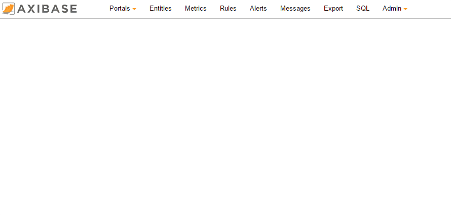
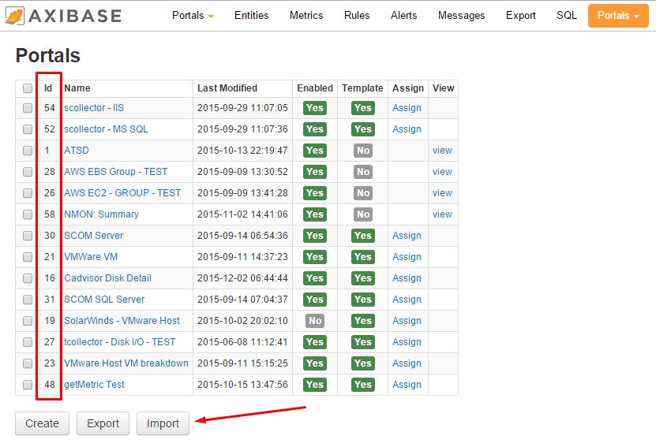
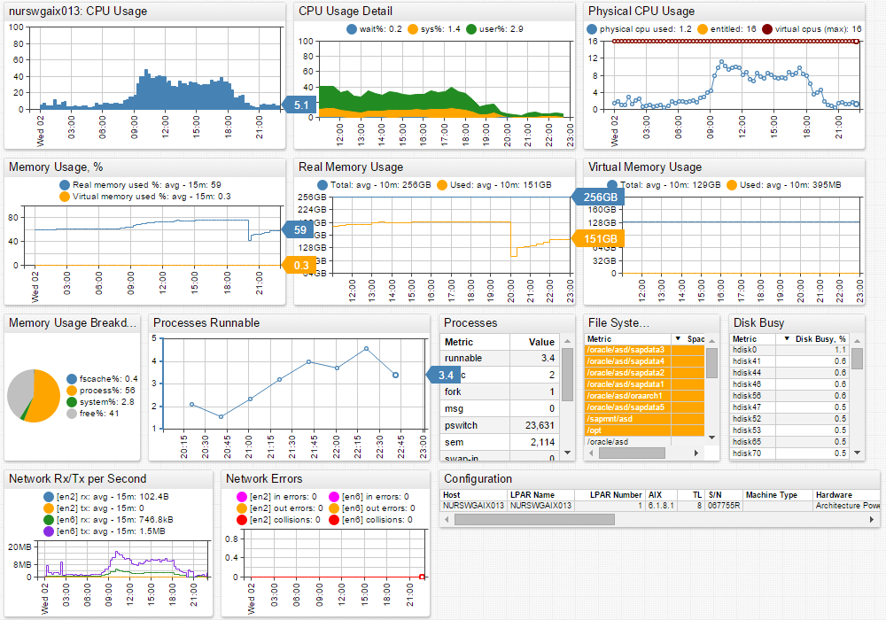

# Visualizing nmon Files in ad-hoc Mode

Axibase Time Series Database provides ad-hoc visualization of Linux and AIX nmon files.

This means that you can upload any nmon file or an archive of nmon files into ATSD and instantly view the data in a pre-configured portal.

## Execute the following steps to start visualizing data from one or multiple nmon files

### Download the ad-hoc nmon portals

nmon Linux:
[https://axibase.com/public/nmon\_Linux.xml](https://axibase.com/public/nmon_Linux.xml)

nmon AIX:
[https://axibase.com/public/nmon\_AIX.xml](https://axibase.com/public/nmon_AIX.xml)

#### Import the portal

This is a one time task.

- Navigate to Admin – Portals.
- At the bottom of the page click “Import” and select either the downloaded “nmon\_AIX” or “nmon\_Linux” portal. If you arecollecting data from AIX systems then choose “nmon \_AIX”, if you are collecting data from Linux systems then choose “nmon\_Linux”.
- On the Portals page, note down the unique ID of the portal that you just imported.

###  Upload the nmon file:

- Navigate to Admin – nmon Parsers.
- At the bottom of the page, click “Upload” to import your nmon file or archive of nmon files using the “default” nmon parser.
- Note down the hostname for which you have just uploaded the data.

You can learn more about uploading nmon files into ATSD
[here](http://axibase.com/products/axibase-time-series-database/writing-data/nmon/file-upload/).

### View the data:

-   Navigate to the following URL replacing **atsd\_server** with your ATSD url, **hostname** with the hostname for which you have uploadedthe nmon file, and **portal\_id** with your portal ID:

http://**atsd\_host**:8088/portal/tabs?entity=**hostname**&id=**portal\_id**

