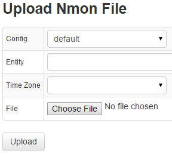

#File Upload

Uploading nmon files can be done using a wget command or using the ATSD UI.

Below is the command and settings for uploading `nmon` files using a `wget` command.

*Plain*

```sh
wget --header="Content-type: text/csv" --post-file=file.nmon 'http://server:port/nmon/wget?config=config_name&amp;entity=entity_name&amp;timeZone=time_zone_id'                                                         
```

*Gzip*

```sh                  
wget --header="Content-type: text/csv" --header="Content-Encoding: gzip" --post-file=file.nmon.gz 'http://server:port/nmon/wget?config=config_name&amp;entity=entity_name&amp;timeZone=time_zone_id'                    
```

## Special Parameters

-   config (required) – name of nmon parser configuration in the ATSD
-   entity (optional) – name of entity. If left blank, the parser will use the host record from the [nmon header](http://axibase.com/products/axibase-time-series-database/writing-data/nmon/headers/ "Headers") as the entity name
-   timeZone (optional) – time zone where the data was recorded

Multiple nmon files can be uploaded simultaneously if archived. It is possible for the archive to contain nmon files from multiple hosts. In this case, leave the entity field blank and the parser will use the host record from the [nmon header](https://axibase.com/products/axibase-time-series-database/writing-data/nmon/headers/ "Headers") as the entity name.

## Supported compression formats

> .zip, .tar, .tar.gz, .tar.bz2

## Below is a screenshot of nmon file upload UI:

