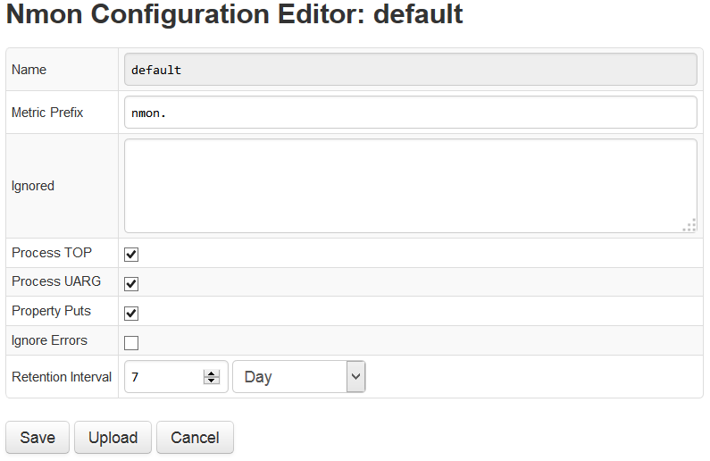

# Parser

The nmon parser ingests raw nmon files and converts them to properties and metrics in the ATSD.

During the installation of ATSD, a default nmon parser is created for ingesting standard nmon files. Settings of the default parser are shown in the table below.

#### Parser Settings

| Setting | Description | Default Parser Settings | 
| --- | --- | --- | 
|  
Name
  |  
Name of the current parser
  |  
default
  | 
|  
Metric Prefix
  |  
Prefix to be added before each nmon metric in order to distinguish and sort metrics with same or similar names, for example: using the prefix nmon will convert the metric cpu_total.busy to nmon.cpu_total.busy
  |  
nmon.
  | 
|  
Ignored
  |  
nmon metrics to be ignored, metrics listed here will not be imported, acts as a filter
  |  
none
  | 
|  
Process TOP
  |  
Ingest TOP data
  |  
Yes
  | 
|  
Process UARG
  |  
Ingest user and arg columns
  |  
Yes
  | 
|  
Enable Properties
  |  
Store entity properties and configurations in ATSD from nmon file
  |  
Yes
  | 
|  
Ignore Errors
  |  
Ignore all errors, parse only known metrics and properties
  |  
No
  | 
|  
Retention Interval
  |  
How long the uploaded nmon file will be stored on the ATSD server, 2 days by default
  |  
7 days
  | 

